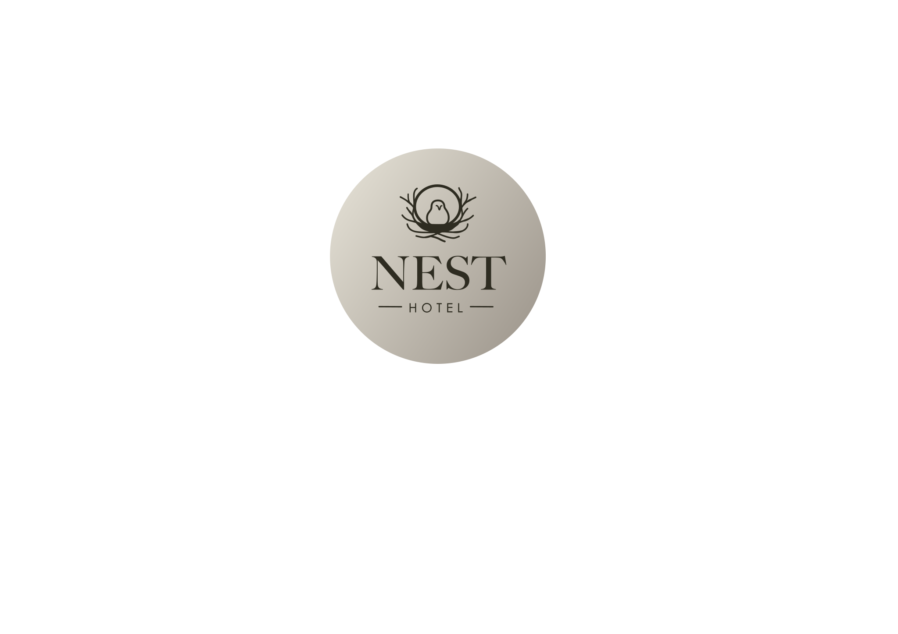

[MiguelColl]: https://github.com/MiguelColl

[LtVish]: https://github.com/LtVish

[DanielAlmazan]: https://github.com/DanielAlmazan


# HOTEL NEST

## Cleaning services <a href="https://github.com/MiguelColl"></a>

Responsible:
[Miguel Collado][MiguelColl]

### Cleaning routes

#### GET

> [!CAUTION]  
> Not implemented  
> '/limpieza/:id'  
> Gets the list of all cleanings for the room with the specified id, ordered by date in descending order. If there are
> no cleanings, an empty array will be returned.

Response example

```json5
[
  {
    "_id": "20012b2b2b2b2b2b2b2b2b2b",
    "habitacion": "2b2b2b2b2b2b2b2b2b2b2b2b",
    "fecha": "2023-09-20T11:24:00Z",
  },
  {
    "_id": "20011a1a1a1a1a1a1a1a1a1a",
    "habitacion": "1a1a1a1a1a1a1a1a1a1a1a1a",
    "fecha": "2023-09-18T10:59:12Z",
    "observaciones": 'Dejan toallas para cambiar'
  }
]
```

> [!CAUTION]  
> Not implemented  
> '/limpieza/limpia/:id'


> [!CAUTION]  
> Not implemented  
> '/limpieza/limpias'

#### POST

> [!CAUTION]  
> Not implemented  
> '/limpieza'  
> Inserts a new cleaning for a room. The inserted cleaning object will be returned if everything went well, or a Bad
> Request (code 400) in case of an error.

#### Examples

Request:

```json5
{
  "_id": "20011a1a1a1a1a1a1a1a1a1a", // string(uuid) (optional)
  "habitacion": "1a1a1a1a1a1a1a1a1a1a1a1a", // string(uuid)
  "fecha": "2023-09-18T10:59:12Z", // Date (default Date.now)
  "observaciones": 'Dejan toallas para cambiar' // string (optional)
}
```

Response:

```json5
{
  "_id": "20011a1a1a1a1a1a1a1a1a1a",
  "habitacion": "1a1a1a1a1a1a1a1a1a1a1a1a",
  "fecha": "2023-09-18T10:59:12Z",
  "observaciones": 'Dejan toallas para cambiar',
  "__v": 0
}
```

Request

```json5
{
  "habitacion": "1a1a1a1a1a1a1a1a1a1a1a1a",
  // string(uuid)
}
```

Response:

```json5
{
  "_id": "65e1ad208e74dc5df6612f4e",
  "habitacion": "1a1a1a1a1a1a1a1a1a1a1a1a",
  "fecha": "2023-09-18T10:59:12Z",
  "observaciones": ""
}
```

(Bad) Request:

```json5
{
  "habitacion": "1a1a1a1a1a1a1a",
  // string(not uuid)
  "fecha": "2023-09-18T10:59:12Z",
  // Date
  "observaciones": 'Dejan toallas para cambiar'
  // string
}
```

Response:

```json5
// Status 400
{
  "ok": false,
  "error": "Error al obtener limpiezas"
}
```

#### PUT

> [!CAUTION]  
> Not implemented  
> '/limpieza/:id'  
> Modifies the data of a cleaning given its id (the cleaning's id). In the request body, it can receive both a new date
> and new observations, and only the relevant fields will be updated.  
> Returns 404 if the cleaning does not exist, 400 if the request is incorrect, and 200 if everything went well.

#### Examples

Request:

```json5
{
  "_id": "20011a1a1a1a1a1a1a1a1a", // cleaning id - string(uuid)
  "fecha": "2023-09-18T10:59:12Z", // Date (optional)
  "observaciones": 'He cambiado las toallas.' // string (optional)
}
```

Response:

```json5
{
  "_id": "20011a1a1a1a1a1a1a1a1a1a",
  "habitacion": "1a1a1a1a1a1a1a1a1a1a1a",
  "fecha": "2023-09-18T10:59:12Z",
  "observaciones": 'He cambiado las toallas.',
  "__v": 0
}
```

(Bad) Request:

```json5
{
  "fecha": "Miércoles", // not Date
  "observaciones": 'Dejan toallas para cambiar'// string
}
```

Response:

```json5
// Status 400
{
  "ok": false,
  "error": ""
}
```

Request
```json5
{
  "_id": "20011a1a1a1e1e1a1b1b1b", // cleaning id - string(uuid)
  "fecha": "2024-09-18T10:59:12Z", // Date (optional)
  "observaciones": 'He cambiado las toallas.' // string (optional)
}
```

Response:

```json5
// Status 404
{
  "ok": false,
  "error": "No se encontró la limpieza"
}
```

## Authentication service <a href="https://github.com/LtVish"></a>

Responsible:
[Aitor Moreno Iborra][LtVish]

## Testing <a href="https://github.com/DanielAlmazan"></a>

Responsible:
[Daniel Enrique Almazán Sellés][DanielAlmazan]

> [!CAUTION]  
> Not implemented

```bash
$ node test/axios/axiosTests.mjs
```
#### Test cases
> ❌ Not implemented  
> ⭕️ Implemented not passing  
> ✅ Implemented and passing

⭕️ Get every cleaning of a room  
⭕️ Get if a room is clean or not  
❌ Get every cleaned room today  
❌ Correct login  
❌ Incorrect login  
❌ Insert a cleaning without correct login  
❌ Insert a cleaning with correct login  
❌ Modify a cleaning without correct login  
❌ Modify a cleaning with correct login  

<p align="center">
  <a href="http://nestjs.com/" target="blank"></a>
</p>

[circleci-image]: https://img.shields.io/circleci/build/github/nestjs/nest/master?token=abc123def456

[circleci-url]: https://circleci.com/gh/nestjs/nest

  <p align="center">A progressive <a href="http://nodejs.org" target="_blank">Node.js</a> framework for building efficient and scalable server-side applications.</p>
    <p align="center">
<a href="https://www.npmjs.com/~nestjscore" target="_blank"></a>
<a href="https://www.npmjs.com/~nestjscore" target="_blank"></a>
<a href="https://www.npmjs.com/~nestjscore" target="_blank"></a>
<a href="https://circleci.com/gh/nestjs/nest" target="_blank"></a>
<a href="https://coveralls.io/github/nestjs/nest?branch=master" target="_blank"></a>
<a href="https://discord.gg/G7Qnnhy" target="_blank"></a>
<a href="https://opencollective.com/nest#backer" target="_blank"></a>
<a href="https://opencollective.com/nest#sponsor" target="_blank"></a>
  <a href="https://paypal.me/kamilmysliwiec" target="_blank"></a>
    <a href="https://opencollective.com/nest#sponsor"  target="_blank"></a>
  <a href="https://twitter.com/nestframework" target="_blank"></a>
</p>
  <!--[](https://opencollective.com/nest#backer)
  [](https://opencollective.com/nest#sponsor)-->

## Description

[Nest](https://github.com/nestjs/nest) framework TypeScript starter repository.

## Installation

```bash
$ npm install
```

## Running the app

```bash
# development
$ npm run start

# watch mode
$ npm run start:dev

# production mode
$ npm run start:prod
```

## Test

```bash
# unit tests
$ npm run test

# e2e tests
$ npm run test:e2e

# test coverage
$ npm run test:cov
```

## Support

Nest is an MIT-licensed open source project. It can grow thanks to the sponsors and support by the amazing backers. If
you'd like to join them, please [read more here](https://docs.nestjs.com/support).

## Stay in touch

- Author - [Kamil Myśliwiec](https://kamilmysliwiec.com)
- Website - [https://nestjs.com](https://nestjs.com/)
- Twitter - [@nestframework](https://twitter.com/nestframework)

## License

Nest is [MIT licensed](LICENSE).
