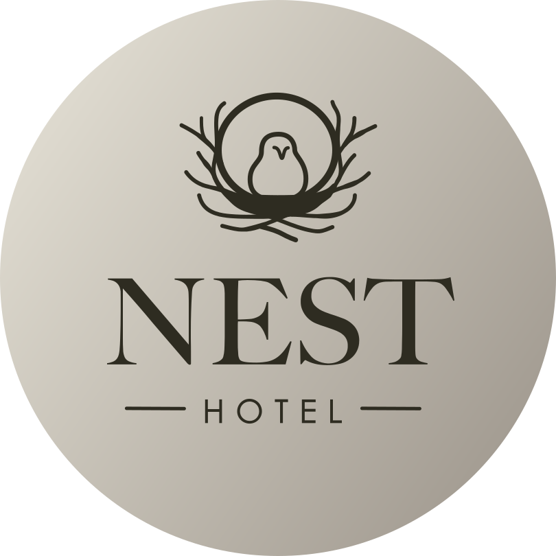

<!-- Links references -->
[MiguelColl]: https://github.com/MiguelColl

[LtVish]: https://github.com/LtVish

[DanielAlmazan]: https://github.com/DanielAlmazan


<p align="center"><a href="https://iessanvicente.com/" target="_blank"></a></p>



# HOTEL NEST

> [!IMPORTANT]  
> This project will eventually be complemented by other projects.

## Cleaning services <a href="https://github.com/MiguelColl"></a>

Responsible:
[Miguel Collado][MiguelColl]

### Cleaning routes

> [!CAUTION]  
> The requests might not well described. In some services, instead of using room id, we're using the whole room object.

#### GET

###### '/limpieza/:id'  
> Gets the list of all cleanings for the room with the specified id, ordered by date in descending order.
> If there are no cleanings, an empty array will be returned.

Response example

```json
[
  {
    "_id": "20012b2b2b2b2b2b2b2b2b2b",
    "habitacion": "2b2b2b2b2b2b2b2b2b2b2b2b",
    "fecha": "2023-09-20T11:24:00Z",
    "observaciones": ""
  },
  {
    "_id": "20011a1a1a1a1a1a1a1a1a1a",
    "habitacion": "1a1a1a1a1a1a1a1a1a1a1a1a",
    "fecha": "2023-09-18T10:59:12Z",
    "observaciones": "Dejan toallas para cambiar"
  }
]
```

###### '/limpieza/limpia/:id'
> Gets the cleaning status of a room given its id.

Response example
```json
{
  "ok": false
}
```

###### '/limpieza/limpias'
> Gets the list of all rooms that have been cleaned today.

Response example
```json
[
  {
    "_id": "2b2b2b2b2b2b2b2b2b2b2b2b",
    "numero": 2,
    "tipo": "familiar",
    "descripcion": "Habitación familiar, cama XL y literas, aseo con bañera",
    "ultimaLimpieza": "2024-04-05T09:05:40.400Z",
    "precio": 65.45,
    "incidencias": [
      {
        "descripcion": "Descripción de prueba",
        "_id": "65954723750cad27d2b508c0",
        "inicio": "2024-01-03T11:38:11.113Z",
        "fin": "2024-01-03T11:38:11.117Z"
      },
      {
        "descripcion": "Uuuuuh",
        "_id": "65d718ca1ab3b2d9e226c0a8",
        "inicio": "2024-02-22T09:50:02.460Z",
        "fin": "2024-04-04T10:40:22.898Z"
      }
    ],
    "__v": 0
  }
]
```
#### POST

###### '/limpieza'  
> Inserts a new cleaning for a room. The inserted cleaning object will be returned if everything went well, or a Bad
> Request (code 400) in case of an error.

#### Examples

Request:

```json
{
  "_id": "20011a1a1a1a1a1a1a1a1a1a",
  "habitacion": "1a1a1a1a1a1a1a1a1a1a1a1a",
  "fecha": "2023-09-18T10:59:12Z",
  "observaciones": "Dejan toallas para cambiar"
}
```

Response:

```json
{
  "_id": "20011a1a1a1a1a1a1a1a1a1a",
  "habitacion": "1a1a1a1a1a1a1a1a1a1a1a1a",
  "fecha": "2023-09-18T10:59:12Z",
  "observaciones": "Dejan toallas para cambiar",
  "__v": 0
}
```

(Bad) Request (missing date):
```json
{
  "habitacion": "1a1a1a1a1a1a1a1a1a1a1a1a"
}
```

Response:

```json
{
  "message": [
    "fecha must be a valid ISO 8601 date string",
    "La fecha es obligatoria"
  ],
  "error": "Bad Request",
  "statusCode": 400
}
```

(Bad) Request (wrong room id):
```json
{
  "habitacion": "1a1a1a1a1a",
  "fecha": "2023-09-18T10:59:12Z"
}
```

Response:
```json
{
  "message": [
    "El ID de la habitación no existe"
  ],
  "error": "Bad Request",
  "statusCode": 400
}
```

#### PATCH

###### '/limpieza/:id'  
> Modifies the data of a cleaning given its id (the cleaning's id). In the request body, it can receive both a new date
> and new observations, and only the relevant fields will be updated.

> Returns 404 if the cleaning does not exist, 400 if the request is incorrect, and 200 if everything went well.

#### Examples

Request:

```json
{
  "observaciones": "He cambiado las toallas."
}
```

Response:

```json
{
  "_id": "20011a1a1a1a1a1a1a1a1a1a",
  "habitacion": "1a1a1a1a1a1a1a1a1a1a1a",
  "fecha": "2023-09-18T10:59:12Z",
  "observaciones": "He cambiado las toallas.",
  "__v": 0
}
```

(Bad) Request:

```json
{
  "fecha": "Miércoles"
}
```

Response:

```json
{
  "message": [
    "fecha must be a valid ISO 8601 date string"
  ],
  "error": "Bad Request",
  "statusCode": 400
}
```

Request (non-existent cleaning):

```json
{
  "observaciones": "He cambiado las toallas."
}
```

Response:
```json
{
  "message": "La limpieza buscada no existe",
  "error": "Internal Server Error",
  "statusCode": 500
}
```

## Authentication service <a href="https://github.com/LtVish"></a>

Responsible:
[Aitor Moreno Iborra][LtVish]

### Authentication routes

#### POST

###### '/login'  
> Authenticates a user given its login and password.  
> If the credentials are correct, a token will be returned, 
> and if not, a 401 Unauthorized status code.

#### Examples

Request:

```json
{
  "login": "admin",
  "password": "realAdminPassword"
}
```

Response:

```json
{
  "ok": true,
  "resultado": "token_itself"
}
```

(Bad) Request:

```json
{
  "login": "admin",
  "password": "notRealAdminPassword"
}
```

Response:

```json
{
  "message": "Unauthorized",
  "statusCode": 401
}
```

## Testing <a href="https://github.com/DanielAlmazan"></a>

Responsible:
[Daniel Enrique Almazán Sellés][DanielAlmazan]


```bash
$ node test/axios/axiosTests.mjs
```
#### Test cases
> ❌ Not implemented  
> ⭕️ Implemented not passing  
> ✅ Implemented and passing

✅️ Get every cleaning of a room  
✅️ Get if a room is clean or not  
✅ Get every cleaned room today  
✅ Correct login  
✅ Incorrect login  
✅ Insert a cleaning without correct login  
✅ Insert a cleaning with correct login  
✅ Modify a cleaning without correct login  
✅ Modify a cleaning with correct login  

<p align="center">
  <a href="http://nestjs.com/" target="blank"></a>
</p>

[circleci-image]: https://img.shields.io/circleci/build/github/nestjs/nest/master?token=abc123def456

[circleci-url]: https://circleci.com/gh/nestjs/nest

  <p align="center">A progressive <a href="http://nodejs.org" target="_blank">Node.js</a> framework for building efficient and scalable server-side applications.</p>
    <p align="center">
<a href="https://www.npmjs.com/~nestjscore" target="_blank"></a>
<a href="https://www.npmjs.com/~nestjscore" target="_blank"></a>
<a href="https://www.npmjs.com/~nestjscore" target="_blank"></a>
<a href="https://circleci.com/gh/nestjs/nest" target="_blank"></a>
<a href="https://coveralls.io/github/nestjs/nest?branch=master" target="_blank"></a>
<a href="https://discord.gg/G7Qnnhy" target="_blank"></a>
<a href="https://opencollective.com/nest#backer" target="_blank"></a>
<a href="https://opencollective.com/nest#sponsor" target="_blank"></a>
  <a href="https://paypal.me/kamilmysliwiec" target="_blank"></a>
    <a href="https://opencollective.com/nest#sponsor"  target="_blank"></a>
  <a href="https://twitter.com/nestframework" target="_blank"></a>
</p>
  <!--[](https://opencollective.com/nest#backer)
  [](https://opencollective.com/nest#sponsor)-->

## Description

[Nest](https://github.com/nestjs/nest) framework TypeScript starter repository.

## Installation

```bash
$ npm install
```

## Running the app

```bash
# development
$ npm run start

# watch mode
$ npm run start:dev

# production mode
$ npm run start:prod
```

## Test

```bash
# unit tests
$ npm run test

# e2e tests
$ npm run test:e2e

# test coverage
$ npm run test:cov
```

## Support

Nest is an MIT-licensed open source project. It can grow thanks to the sponsors and support by the amazing backers. If
you'd like to join them, please [read more here](https://docs.nestjs.com/support).

## Stay in touch

- Author - [Kamil Myśliwiec](https://kamilmysliwiec.com)
- Website - [https://nestjs.com](https://nestjs.com/)
- Twitter - [@nestframework](https://twitter.com/nestframework)

## License

Nest is [MIT licensed](LICENSE).
